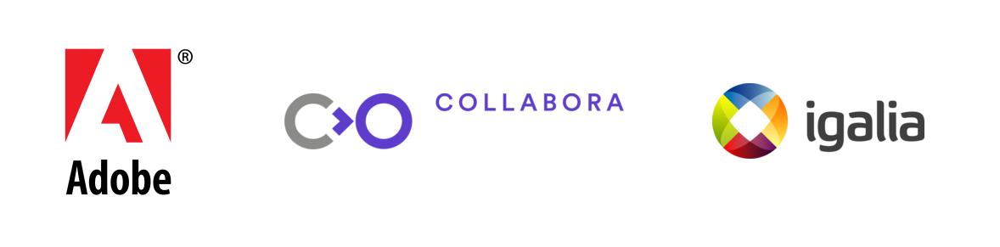

# Web Engines Hackfest

Repository containing the web page of the **Web Engines Hackfest 2014**.

* URL: http://www.webengineshackfest.org/2014/
* Repository: https://github.com/Igalia/webengineshackfest/wiki

## Wiki

* https://github.com/Igalia/webengineshackfest/wiki/2014

## Instructions to update the website

* Clone the repository:
  ```git clone git@github.com:Igalia/webengineshackfest.git```
* Do some changes and commit:
  ```git commit -a -m "Commit message"```
* Push changes into `master` branch:
  ```git push origin master```
* Go to `gh-pages` branch:
  ```git checkout origin/gh-pages -b gh-pages```
* Merge `gh-pages` branch with `master`:
  ```git merge master```
* Push changes into `gh-pages` branch:
  ```git push origin gh-pages```

Please, try to keep both branches `master` and `gh-pages` synchronized.

## Sponsors

[](http://www.webengineshackfest.org/#sponsors)
